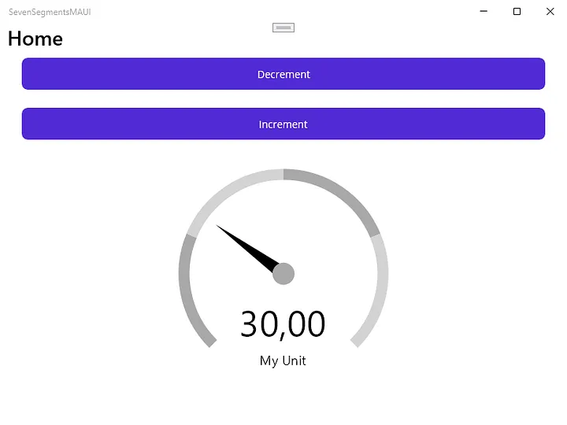
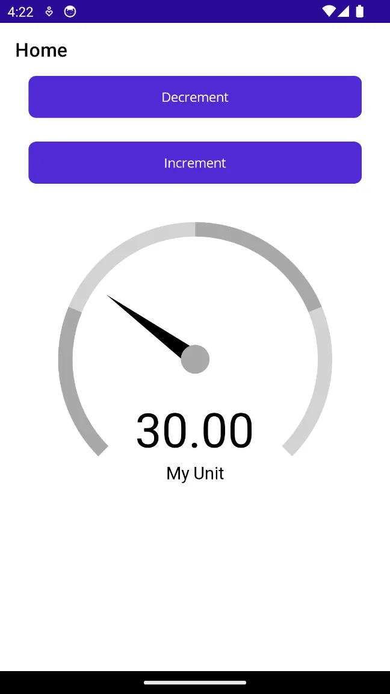

# Gauge control using SkiaSharp in .NET MAUI

This repository demonstrates how to implement a `GaugeView` control using SkiaSharp to be used in any .NET MAUI application.

## Getting Started

Install the [SkiaSharp.Views.Maui.Control NuGet package](https://www.nuget.org/packages/SkiaSharp.Views.Maui.Controls) to your .NET MAUI application.

Now, open the `MauiProgram.cs` file and add the `.UseSkiaSharp()` call to the `builder` property.

Create a new folder named Controls. In this folder, we will add a new class called `GaugeView`. See the `GaugeView` class in this repository to see the implementation.

## Screenshots

Here is a screenshot of our Gauge control running on a Windows machine.

Here is a screenshot of our Gauge control running on an Android phone.

## Blog Post / Further information

If you are more interested into details, please see the following post on [medium.com](https://www.medium.com):

- [Create a Gauge control using SkiaSharp in .NET MAUI](https://medium.com/@tsjdevapps/create-a-gauge-control-using-skiasharp-in-net-maui-ce418e6320fb)

> This article is my contribution to [#MAUIUIJULY](https://x.com/hashtag/MAUIUIJuly), a series of blog posts where every day in July, a .NET MAUI community member posts something about .NET MAUI and UI. You can find the list of all available blog posts on [this website](https://goforgoldman.com/posts/mauiuijuly-24/).